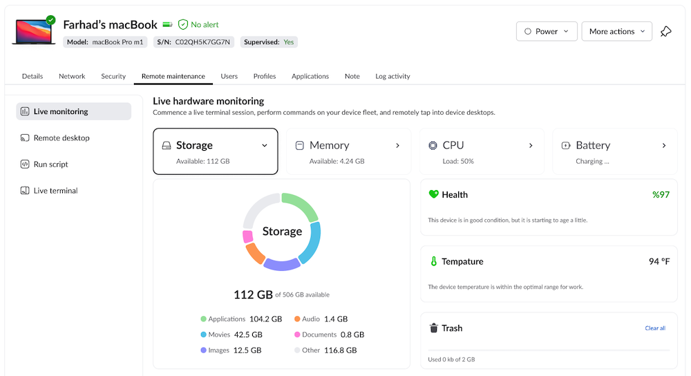
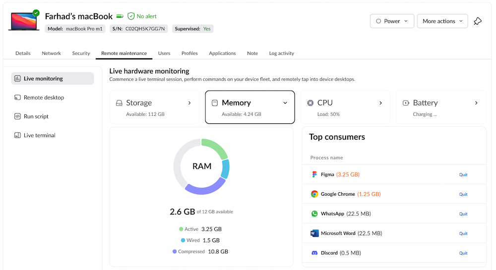
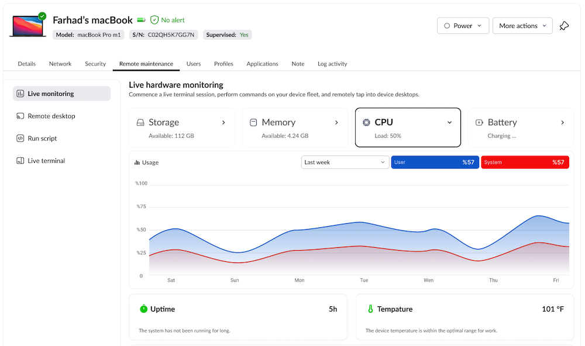
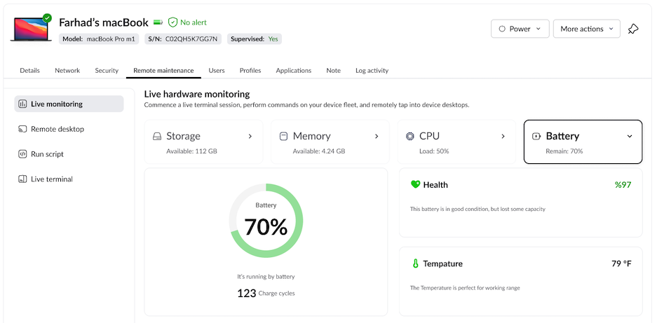

# SystemState

[](https://gitlab.sibgmbh.com/trio/mac-os/systemstate/-/commits/develop)
[](https://gitlab.sibgmbh.com/trio/mac-os/systemstate/-/commits/develop)
[](https://gitlab.sibgmbh.com/trio/mac-os/systemstate/-/releases)






macOS system monitor.
## Features
SystemState is an application that allows you to monitor your macOS system.

- [x] CPU utilization
- [x] Memory usage
- [x] Storage utilization
- [x] Battery level
- [x] Sensors information (Temperature, Voltage, Power)
- [x] Device info (os name, os version, memory type, GPU type, storage type, storage size, ...)
- [ ] Network usage
- [ ] GPU utilization


## Installation

- File > Swift Packages > Add Package Dependency
- Add `https://gitlab.sibgmbh.com/trio/mac-os/systemstate.git`
- Select "Up to Next Major" with "0.1.0"

If you encounter any problem or have a question on adding the package to an Xcode project, I suggest reading the [Adding Package Dependencies](https://developer.apple.com/documentation/xcode/adding_package_dependencies_to_your_app) to Your App guide article from Apple.

## Requirements
- macOS 12.0+ 
- Swift 5.8+

## Usage

### systemstate
 ```swift
import systemstate

// CPU information
let cpu = CPU()
let cpuLoad: CPULoad = cpu.cpuLoad
let topProcess = cpu.topProcess
 
//================================================================

// Battery information
let battery = Battery()
let batteyInfo: BatteryInfoModel = battery.batteyInfo
let topProcess = battery.topProcess

//================================================================

// DeviceInfo information
let osName = DeviceInfo.osName
let osFullVersion = DeviceInfo.osFullVersion
let cpuName = DeviceInfo.cpuName
let memory = DeviceInfo.memory
let gpu = DeviceInfo.gpu
let storageModel = DeviceInfo.storageModel
let storageSize = DeviceInfo.storageSize
let uptime = DeviceInfo.uptime
let serialNumber = DeviceInfo.serialNumber

//================================================================

// Memory information
let memory = Memory()
let memoryUsage: MemoryUsage = memory.memoryUsage
let topProcess = memory.topProcess

//================================================================

// Sensors information
let type: ModuleType = .Storage
let sensors = Sensors()
let diskTempreture = sensors.temprator(type)

//================================================================

// Storage information
let storage = Storage()
let storageInfo: StorageModel = storage.storageInfo
let topProcess = storage.topProcess

```

### CPU
 ```swift
import CPU

// CPU information
let cpu = CPU()
let cpuLoad: CPULoad = cpu.cpuLoad

let systemLoad = cpuload.systemLoad
let userLoad = cpuload.userLoad
let idleLoad = cpuload.idleLoad

let topProcess = cpu.topProcess
 
```

### Battery
 ```swift
import Battery

// Battery information
let battery = Battery()
let batteyInfo: BatteryInfoModel = battery.batteyInfo

let level = batteryInfo.level
let cycles = batteryInfo.cycles
let health = batteryInfo.health

let topProcess = battery.topProcess
 
```

### DeviceInfo
 ```swift
import DeviceInfo

// DeviceInfo information
let osName = DeviceInfo.osName
let osFullVersion = DeviceInfo.osFullVersion
let cpuName = DeviceInfo.cpuName
let memory = DeviceInfo.memory
let gpu = DeviceInfo.gpu
let storageModel = DeviceInfo.storageModel
let storageSize = DeviceInfo.storageSize
let uptime = DeviceInfo.uptime
let serialNumber = DeviceInfo.serialNumber
 
```

### Memory
 ```swift
import Memory

// Memory information
let memory = Memory()
let memoryUsage: MemoryUsage = memory.memoryUsage

let active = memoryUsage.active
let inactive = memoryUsage.inactive
let wired = memoryUsage.wired
let compressed = memoryUsage.compressed

let topProcess = memory.topProcess
 
```

### Sensors
 ```swift
import Sensors

// Sensors information
let type: ModuleType = .Storage
let sensors = Sensors()
let diskTempreture = sensors.temprator(type)
 
```

### Storage
 ```swift
import Storage

// Storage information
let storage = Storage()
let storageInfo: StorageModel = storage.storageInfo

let total = storageInfo.total
let free = storageInfo.free
let used = storageInfo.used
 
```
